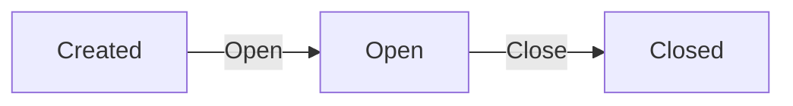
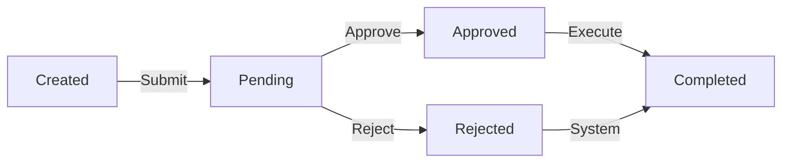

# Data Model: Customer Support and Refund Service

**Date**: 2026-01-14 | **Feature**: 001-support-refund-service

## Entities and Relationships

### Support Case

**Fields:**
- `id` (UUID, primary key)
- `customer_id` (UUID, foreign key to Customer)
- `order_id` (UUID, foreign key to Order)
- `products` (JSON array of product IDs and quantities)
- `issue_description` (text)
- `status` (enum: "Open", "Closed")
- `created_at` (datetime)
- `closed_at` (datetime, nullable)
- `attachments` (JSON array of file references)

**Relationships:**
- Belongs to Customer (1:many)
- References Order (1:1)
- Has many Refund Cases (1:many)
- References Products (many:many through products array)

**Validation Rules:**
- `customer_id` and `order_id` must reference existing entities
- `products` array must contain valid product IDs from the referenced order
- `status` transitions: Open → Closed (cannot reopen)
- Cannot close if has pending refund cases
- `issue_description` required (min 10 chars, max 2000 chars)

**State Transitions:**
- Created: status = "Open"
- Closed: status = "Closed", closed_at = current timestamp

### Refund Case

**Fields:**
- `id` (UUID, primary key)
- `support_case_id` (UUID, foreign key to Support Case)
- `customer_id` (UUID, foreign key to Customer)
- `order_id` (UUID, foreign key to Order)
- `products` (JSON array with product_id, quantity, price, refund_amount)
- `total_refund_amount` (decimal)
- `status` (enum: "Pending", "Approved", "Rejected", "Completed")
- `eligibility_status` (enum: "Eligible", "Partially Eligible", "Ineligible")
- `created_at` (datetime)
- `processed_at` (datetime, nullable)
- `rejection_reason` (text, nullable)
- `agent_id` (UUID, foreign key to Support Agent, nullable)

**Relationships:**
- Belongs to Support Case (1:1)
- Belongs to Customer (1:many)
- References Order (1:1)
- References Products (many:many through products array)
- Processed by Support Agent (1:1, optional)

**Validation Rules:**
- `support_case_id` must reference existing open support case
- `customer_id` must match support case customer
- `order_id` must match support case order
- Products must be subset of support case products
- Refund eligibility: products must be within 14 days of delivery
- Cannot refund same product multiple times (full amount)
- `total_refund_amount` must equal sum of individual product refunds
- Status transitions: Pending → (Approved|Rejected) → Completed

**Business Rules:**
- Eligibility: Each product checked against delivery date + 14 days
- Partial eligibility: Some products eligible, some not
- Refund amount: Based on original product price × quantity
- Approval: Only by authorized support agents
- Execution: Automatic payment processing on approval

### Order (Existing Entity)

**Relevant Fields for Integration:**
- `id` (UUID, primary key)
- `customer_id` (UUID, foreign key)
- `products` (JSON array with product_id, quantity, price, delivery_date)
- `total_amount` (decimal)
- `status` (enum)
- `created_at` (datetime)

**Integration Points:**
- Support cases reference specific orders
- Refund cases use order product details and delivery dates
- Delivery dates determine refund eligibility

### Product (Existing Entity)

**Relevant Fields for Integration:**
- `id` (UUID, primary key)
- `name` (string)
- `price` (decimal)
- `description` (text)
- `category` (string)

**Integration Points:**
- Support and refund cases reference specific products
- Product details used for display and validation

### Customer (Existing Entity)

**Relevant Fields for Integration:**
- `id` (UUID, primary key)
- `name` (string)
- `email` (string)
- `contact_info` (JSON)

**Integration Points:**
- Owns support cases and refund cases
- Receives notifications

### Support Agent (Existing Role)

**Relevant Fields for Integration:**
- `id` (UUID, primary key)
- `name` (string)
- `email` (string)
- `permissions` (JSON array)

**Integration Points:**
- Processes refund cases
- Requires proper authorization

### Attachment

**Fields:**
- `id` (UUID, primary key)
- `support_case_id` (UUID, foreign key to Support Case)
- `file_name` (string)
- `file_type` (string)
- `file_size` (integer)
- `file_path` (string)
- `upload_date` (datetime)
- `description` (text, optional)

**Validation Rules:**
- File size limit: 10MB maximum
- Supported file types: images (JPEG, PNG), PDF
- Virus scanning required before storage
- Must be associated with existing support case

## Database Schema Considerations

### Indexing Strategy
- `support_cases(customer_id, status)` - Fast customer case lookup
- `support_cases(order_id)` - Order reference lookup
- `refund_cases(support_case_id, status)` - Case status tracking
- `refund_cases(customer_id, status)` - Customer refund history
- `refund_cases(created_at)` - Time-based queries

### Data Integrity Constraints
- Foreign key constraints for all relationships
- Unique constraints on refund case product combinations
- Check constraints for status enums
- Transaction isolation for concurrent operations
- Optimistic locking for concurrent modifications (version field)

## Business Rules and Validation Logic

### Refund Eligibility Algorithm

**Pseudocode:**
```python
def calculate_refund_eligibility(product_delivery_date: date, request_date: date) -> tuple[bool, str]:
    days_since_delivery = (request_date - product_delivery_date).days
    
    if days_since_delivery <= 14:
        return (True, "Eligible - within 14-day window")
    else:
        return (False, f"Not eligible - {days_since_delivery - 14} days over limit")
```

**Edge Cases:**
- Multiple products with different delivery dates
- Partial eligibility scenarios
- Weekend/holiday handling (no extension of window)

### Support Case Closure Validation

**Pseudocode:**
```python
def can_close_support_case(support_case_id: UUID) -> tuple[bool, list]:
    pending_refunds = RefundCase.query.filter(
        RefundCase.support_case_id == support_case_id,
        RefundCase.status == RefundCaseStatus.PENDING
    ).all()
    
    if pending_refunds:
        return (False, [r.id for r in pending_refunds])
    return (True, [])
```

### Refund Amount Calculation

**Pseudocode:**
```python
def calculate_total_refund_amount(product_refunds: List[ProductRefund]) -> Decimal:
    total = Decimal('0.00')
    for product_refund in product_refunds:
        amount = product_refund.original_price * product_refund.quantity
        total += amount.quantize(Decimal('0.01'))  # Round to 2 decimal places
    return total
```

## API Endpoint Specifications

### Support Case Endpoints

**POST /api/v1/support-cases**
- **Request Body:**
  ```json
  {
    "order_id": "uuid",
    "product_ids": ["uuid1", "uuid2"],
    "issue_description": "string",
    "attachments": [{"file_id": "uuid", "description": "string"}]
  }
  ```
- **Response (201 Created):**
  ```json
  {
    "id": "uuid",
    "customer_id": "uuid",
    "order_id": "uuid",
    "products": [{"id": "uuid", "name": "string"}],
    "issue_description": "string",
    "status": "Open",
    "created_at": "iso-datetime",
    "attachments": [{"id": "uuid", "name": "string", "url": "string"}]
  }
  ```

**GET /api/v1/support-cases/{id}**
- **Response (200 OK):**
  ```json
  {
    "id": "uuid",
    "customer_id": "uuid", 
    "order_id": "uuid",
    "products": [{"id": "uuid", "name": "string", "price": 99.99}],
    "issue_description": "string",
    "status": "Open",
    "created_at": "iso-datetime",
    "closed_at": null,
    "attachments": [{"id": "uuid", "name": "string", "url": "string"}],
    "refund_cases": [{"id": "uuid", "status": "Pending", "amount": 49.99}]
  }
  ```

### Refund Case Endpoints

**POST /api/v1/support-cases/{support_case_id}/refund-cases**
- **Request Body:**
  ```json
  {
    "product_refunds": [
      {
        "product_id": "uuid",
        "quantity": 1,
        "reason": "Damaged item"
      }
    ]
  }
  ```
- **Response (201 Created):**
  ```json
  {
    "id": "uuid",
    "support_case_id": "uuid",
    "customer_id": "uuid",
    "order_id": "uuid",
    "products": [
      {
        "product_id": "uuid",
        "name": "Designer Chair",
        "quantity": 1,
        "price": 299.99,
        "refund_amount": 299.99,
        "delivery_date": "2026-01-01",
        "eligibility": "Eligible",
        "eligibility_reason": "Within 14-day window"
      }
    ],
    "total_refund_amount": 299.99,
    "status": "Pending",
    "eligibility_status": "Eligible",
    "created_at": "iso-datetime"
  }
  ```

**PUT /api/v1/refund-cases/{id}/approve**
- **Response (200 OK):**
  ```json
  {
    "id": "uuid",
    "status": "Approved",
    "processed_at": "iso-datetime",
    "processed_by": "agent-uuid"
  }
  ```

## Error Handling and Response Codes

### Standard Error Responses

**400 Bad Request** - Validation errors:
```json
{
  "error": "validation_error",
  "message": "Invalid request data",
  "details": {
    "issue_description": ["must be at least 10 characters"],
    "product_ids": ["must contain valid product IDs from the order"]
  }
}
```

**401 Unauthorized** - Authentication required:
```json
{
  "error": "unauthorized",
  "message": "Authentication required"
}
```

**403 Forbidden** - Insufficient permissions:
```json
{
  "error": "forbidden",
  "message": "You do not have permission to perform this action"
}
```

**404 Not Found** - Resource not found:
```json
{
  "error": "not_found",
  "message": "Support case not found"
}
```

**409 Conflict** - Business rule violation:
```json
{
  "error": "conflict",
  "message": "Cannot close support case with pending refunds",
  "pending_refunds": ["refund-uuid-1", "refund-uuid-2"]
}
```

## Integration Requirements

### Existing Order System Integration

**Required Data:**
- Order details (customer, products, amounts)
- Product delivery dates (per product basis)
- Order status and history

**Integration Method:**
- Read-only API access to order system
- Database views for order data (if same database)
- Cached order information for performance

### Email Notification Service Integration

**Notification Events:**
1. **SupportCaseCreated** - Customer notification with case details
2. **RefundCaseCreated** - Customer notification with eligibility status
3. **RefundCaseStatusChanged** - Customer notification on approval/rejection/completion
4. **SupportCaseClosed** - Customer notification with summary

**Event Payload Example:**
```json
{
  "event_type": "SupportCaseCreated",
  "timestamp": "2026-01-14T12:00:00Z",
  "recipient": "customer@example.com",
  "template": "support_case_created",
  "context": {
    "case_id": "uuid",
    "order_id": "uuid",
    "issue_description": "string",
    "support_url": "https://..."
  }
}
```

## API Data Contracts

### Support Case
```typescript
interface SupportCase {
  id: string;
  customerId: string;
  orderId: string;
  products: Array<{
    productId: string;
    quantity: number;
    name?: string;
    price?: number;
  }>;
  issueDescription: string;
  status: 'Open' | 'Closed';
  createdAt: string; // ISO datetime
  closedAt?: string; // ISO datetime
  attachments?: Array<{
    id: string;
    name: string;
    url: string;
  }>;
}
```

### Refund Case
```typescript
interface RefundCase {
  id: string;
  supportCaseId: string;
  customerId: string;
  orderId: string;
  products: Array<{
    productId: string;
    quantity: number;
    name: string;
    price: number;
    refundAmount: number;
    deliveryDate: string; // ISO date
    eligibility: 'Eligible' | 'Ineligible';
  }>;
  totalRefundAmount: number;
  status: 'Pending' | 'Approved' | 'Rejected' | 'Completed';
  eligibilityStatus: 'Eligible' | 'Partially Eligible' | 'Ineligible';
  createdAt: string; // ISO datetime
  processedAt?: string; // ISO datetime
  rejectionReason?: string;
  agentId?: string;
}
```

## State Machine Diagrams

### Support Case State Machine


### Refund Case State Machine
