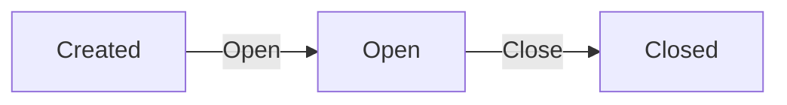
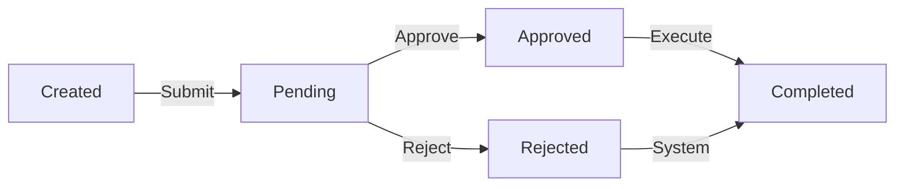

# Data Model: Customer Support and Refund Service

## Entities and Relationships

### Support Case

**Fields:**
- `id` (UUID, primary key)
- `customer_id` (UUID, foreign key to Customer)
- `order_id` (UUID, foreign key to Order)
- `products` (JSON array of product IDs and quantities)
- `issue_description` (text)
- `status` (enum: "Open", "Closed")
- `created_at` (datetime)
- `closed_at` (datetime, nullable)
- `attachments` (JSON array of file references)

**Relationships:**
- Belongs to Customer (1:many)
- References Order (1:1)
- Has many Refund Cases (1:many)
- References Products (many:many through products array)

**Validation Rules:**
- `customer_id` and `order_id` must reference existing entities
- `products` array must contain valid product IDs from the referenced order
- `status` transitions: Open → Closed (cannot reopen)
- Cannot close if has pending refund cases
- `issue_description` required (min 10 chars, max 2000 chars)

**State Transitions:**
- Created: status = "Open"
- Closed: status = "Closed", closed_at = current timestamp

### Refund Case

**Fields:**
- `id` (UUID, primary key)
- `support_case_id` (UUID, foreign key to Support Case)
- `customer_id` (UUID, foreign key to Customer)
- `order_id` (UUID, foreign key to Order)
- `products` (JSON array with product_id, quantity, price, refund_amount)
- `total_refund_amount` (decimal)
- `status` (enum: "Pending", "Approved", "Rejected", "Completed")
- `eligibility_status` (enum: "Eligible", "Partially Eligible", "Ineligible")
- `created_at` (datetime)
- `processed_at` (datetime, nullable)
- `rejection_reason` (text, nullable)
- `agent_id` (UUID, foreign key to Support Agent, nullable)

**Relationships:**
- Belongs to Support Case (1:1)
- Belongs to Customer (1:many)
- References Order (1:1)
- References Products (many:many through products array)
- Processed by Support Agent (1:1, optional)

**Validation Rules:**
- `support_case_id` must reference existing open support case
- `customer_id` must match support case customer
- `order_id` must match support case order
- Products must be subset of support case products
- Refund eligibility: products must be within 14 days of delivery
- Cannot refund same product multiple times (full amount)
- `total_refund_amount` must equal sum of individual product refunds
- Status transitions: Pending → (Approved|Rejected) → Completed

**Business Rules:**
- Eligibility: Each product checked against delivery date + 14 days
- Partial eligibility: Some products eligible, some not
- Refund amount: Based on original product price × quantity
- Approval: Only by authorized support agents
- Execution: Automatic payment processing on approval

### Order (Existing Entity)

**Relevant Fields for Integration:**
- `id` (UUID, primary key)
- `customer_id` (UUID, foreign key)
- `products` (JSON array with product_id, quantity, price, delivery_date)
- `total_amount` (decimal)
- `status` (enum)
- `created_at` (datetime)

**Integration Points:**
- Support cases reference specific orders
- Refund cases use order product details and delivery dates
- Delivery dates determine refund eligibility

### Product (Existing Entity)

**Relevant Fields for Integration:**
- `id` (UUID, primary key)
- `name` (string)
- `price` (decimal)
- `description` (text)
- `category` (string)

**Integration Points:**
- Support and refund cases reference specific products
- Product details used for display and validation

### Customer (Existing Entity)

**Relevant Fields for Integration:**
- `id` (UUID, primary key)
- `name` (string)
- `email` (string)
- `contact_info` (JSON)

**Integration Points:**
- Owns support cases and refund cases
- Receives notifications

### Support Agent (Existing Role)

**Relevant Fields for Integration:**
- `id` (UUID, primary key)
- `name` (string)
- `email` (string)
- `permissions` (JSON array)

**Integration Points:**
- Processes refund cases
- Requires proper authorization

## Database Schema Considerations

### Indexing Strategy
- `support_cases(customer_id, status)` - Fast customer case lookup
- `support_cases(order_id)` - Order reference lookup
- `refund_cases(support_case_id, status)` - Case status tracking
- `refund_cases(customer_id, status)` - Customer refund history
- `refund_cases(created_at)` - Time-based queries

### Data Integrity Constraints
- Foreign key constraints for all relationships
- Unique constraints on refund case product combinations
- Check constraints for status enums
- Transaction isolation for concurrent operations

## API Data Contracts

### Support Case
```typescript
interface SupportCase {
  id: string;
  customerId: string;
  orderId: string;
  products: Array<{
    productId: string;
    quantity: number;
    name?: string;
    price?: number;
  }>;
  issueDescription: string;
  status: 'Open' | 'Closed';
  createdAt: string; // ISO datetime
  closedAt?: string; // ISO datetime
  attachments?: Array<{
    id: string;
    name: string;
    url: string;
  }>;
}
```

### Refund Case
```typescript
interface RefundCase {
  id: string;
  supportCaseId: string;
  customerId: string;
  orderId: string;
  products: Array<{
    productId: string;
    quantity: number;
    name: string;
    price: number;
    refundAmount: number;
    deliveryDate: string; // ISO date
    eligibility: 'Eligible' | 'Ineligible';
  }>;
  totalRefundAmount: number;
  status: 'Pending' | 'Approved' | 'Rejected' | 'Completed';
  eligibilityStatus: 'Eligible' | 'Partially Eligible' | 'Ineligible';
  createdAt: string; // ISO datetime
  processedAt?: string; // ISO datetime
  rejectionReason?: string;
  agentId?: string;
}
```

## State Machine Diagrams

### Support Case State Machine


### Refund Case State Machine
